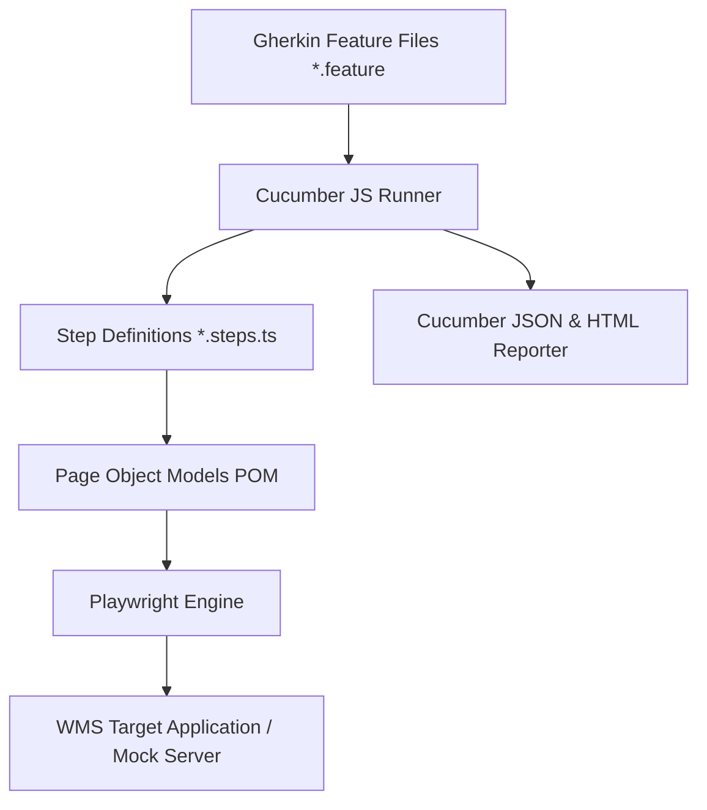

# 📦 Und-wms BDD Test Automation Framework

An automated end-to-end Behavior-Driven Development (BDD) testing framework for **und-wms** (Warehouse Management System), built with **Playwright**, **Cucumber JS**, and **TypeScript**.

The framework covers **WMS Authentication / Login** and **Inbound Warehouse Operations** (Purchase Order receipt, LPN barcode generation, Bin Putaway execution, and Damaged Item Quarantine handling).

---

## 📑 Table of Contents
1. [Framework Architecture](#-framework-architecture)
2. [Directory Structure](#-directory-structure)
3. [Prerequisites & Installation](#-prerequisites--installation)
4. [Test Execution Commands](#-test-execution-commands)
5. [BDD Feature Specifications](#-bdd-feature-specifications)
6. [Page Object Model (POM) Design](#-page-object-model-pom-design)
7. [Test Data Management](#-test-data-management)
8. [HTML Execution Reports](#-html-execution-reports)
9. [Framework Metadata Catalog](#-framework-metadata-catalog)

---

## 🏗️ Framework Architecture



---

## 📁 Directory Structure

```
und-wms/
├── framework-metadata.json      # Framework specification metadata manifest
├── README.md                    # End-to-end framework guide
├── package.json                 # Project dependencies & npm scripts
├── tsconfig.json                # TypeScript configuration
├── cucumber.js                  # Cucumber runner profile definitions
├── mock-wms/
│   └── server.js                # Offline Mock WMS web server simulator
└── src/
    ├── index.ts                 # Central index export & SDK summary helper
    ├── data/
    │   └── testData.json        # User credentials, warehouses, PO fixtures
    ├── features/
    │   ├── login.feature        # BDD scenarios for Login & Authentication
    │   └── inbound.feature      # BDD scenarios for Inbound Receipt & Putaway
    ├── pages/
    │   ├── BasePage.ts          # Core Playwright wrapper methods
    │   ├── LoginPage.ts         # Login Page Object Model
    │   └── InboundPage.ts       # Inbound Receiving Page Object Model
    ├── steps/
    │   ├── hooks.ts             # Browser setup, teardown & screenshot hooks
    │   ├── login.steps.ts       # Step bindings for login.feature
    │   └── inbound.steps.ts     # Step bindings for inbound.feature
    └── utils/
        └── reportGenerator.ts   # HTML report compiler utility
```

---

## ⚙️ Prerequisites & Installation

- **Node.js**: `v18.0.0` or higher
- **npm**: `v9.0.0` or higher

```bash
# Install node dependencies
npm install

# Install Playwright browser binaries
npx playwright install chromium
```

---

## 🚀 Test Execution Commands

| Command | Description |
| :--- | :--- |
| `npm test` | Runs the full BDD test suite (Login + Inbound) against local mock WMS server |
| `npm run test:login` | Runs only WMS Login scenarios (`@login` tag) |
| `npm run test:inbound` | Runs only Inbound Operation scenarios (`@inbound` tag) |
| `npm run test:mock` | Starts the offline Mock WMS web server at `http://localhost:3000` |
| `npm run report` | Generates Cucumber HTML report from test execution results |
| `npm run build` | Compiles TypeScript source files into `dist/` |

---

## 📋 BDD Feature Specifications

### 1. WMS Login & Authentication (`src/features/login.feature`)
- **Valid Login**: Authenticate user `wms_manager` with warehouse `WH-MAIN-01`.
- **Invalid Login**: Verify error message display on wrong password.
- **Multi-Warehouse Outline**: Validate access across multiple facility IDs (`WH-MAIN-01`, `WH-EAST-02`).

### 2. Inbound Operations (`src/features/inbound.feature`)
- **Purchase Order Receipt**: Receive PO `PO-2026-9901` at dock `DOCK-04` and generate `LPN-*` tag.
- **Bin Putaway**: Execute putaway for received LPN into bin `BIN-A1-04`.
- **Damaged Goods Handling**: Record receipt of good vs damaged items with automatic quarantine hold tagging.

---

## 🧩 Page Object Model (POM) Design

- **`BasePage.ts`**: Encapsulates common Playwright actions (`fill`, `click`, `selectOption`, `getText`, `waitForElement`, `captureScreenshot`).
- **`LoginPage.ts`**: High-level page methods (`openLoginPage`, `enterUsername`, `enterPassword`, `selectWarehouse`, `clickLogin`, `getErrorMessage`).
- **`InboundPage.ts`**: Operational domain methods (`searchPurchaseOrder`, `assignDockDoor`, `enterItemReceipt`, `confirmReceiptAndGenerateLPN`, `executePutaway`).

---

## 📊 HTML Execution Reports

Execution results are automatically output to:
- `reports/cucumber-report.json`
- `reports/cucumber-report.html`
- `reports/screenshots/` (screenshots attached automatically for failed test steps)

To generate the report manually:
```bash
npm run report
```

---

## 📄 Framework Metadata Catalog

The repository includes a machine-readable specification in [`framework-metadata.json`](file:///Users/vinayrao/Work/Undocked-Product-RND/GitHub/und-wms/framework-metadata.json) and programmatically exposed via [`src/index.ts`](file:///Users/vinayrao/Work/Undocked-Product-RND/GitHub/und-wms/src/index.ts).

You can import and inspect the framework summary programmatically:
```typescript
import { getFrameworkSummary, LoginPage, InboundPage } from 'und-wms-automation';
console.log(getFrameworkSummary());
```
